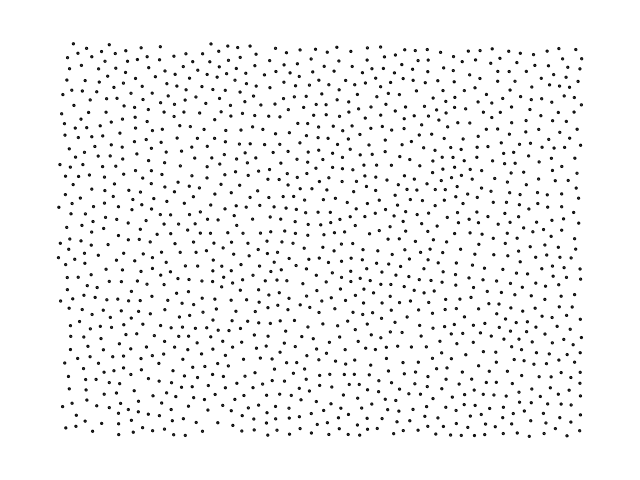

[](https://crates.io/crates/poisson-diskus) [](https://docs.rs/poisson-diskus)

Rust library for sampling a Poisson disk distribution in multiple dimensions.

The Poisson disk distribution produces samples of which no two samples are too close 
to each other. This results in a more uniform distribution than from pure random sampling.



This library is an implementation of the algorithm introduced by Robert Bridson \[1\]
which is O(N) for producing N samples. That is, the sampling time increases linearly 
with the number of produced samples. For two-dimensional sampling, the sampling time 
increases with the area and for three-dimensional sampling with the volume.

# Usage

See the [documentation](https://docs.rs/poisson-diskus/) for more information about the library.

## Set-up
Add the library as a dependency to your project in `Cargo.toml`:
```toml
[dependencies]
#
poisson-diskus = "1.0.0"
```

From `1.0.0` the minimum supported version of Rust is 1.51, due to the use of const generics. 
The pre-release versions (until 1.0.0-pre.4) support earlier versions of Rust.

## Sampling points
To sample, the Bridson algorithm requires:

* `box_size`: the size of the domain as a `D`-dimensional array
* `rmin`: the minimum distance between two sampled points
* `k`: number of attempts to sample around a generated point (recommended value is 30, 
       increase to slightly improve the sampling)
* `use_pbc`: whether the domain is connected to the opposite side and the algorithm
             should look for collisions over this connection
             
The sampled points are returned in a standard vector `Vec<[f64; D]>`, where each point 
is of type `[f64; D]`: a `D`-dimensional array with the coordinates for each axis. The 
dimension `D` is identical to that of the given `box_size`.

```rust
use poisson_diskus::bridson;

let box_size = [3.0, 5.0, 7.0];
let rmin = 0.5;
let k = 30;
let use_pbc = false;

let coords: Vec<[f64; 3]> = bridson(&box_size, rmin, k, use_pbc).unwrap();
```

## Larger number of dimensions
The algorithm can sample in an arbitrary number of dimensions, although it is very slow.

```rust
use poisson_diskus::bridson;

let box_size = [3.0, 5.0, 3.0, 2.0, 1.0];
let rmin = 1.0;
let k = 30;
let use_pbc = false;

let coords: Vec<[f64; 5]> = bridson(&box_size, rmin, k, use_pbc).unwrap();
```

## Periodic boundary conditions
Use the `use_pbc` parameter to control whether the algorithm should look for neighbours
within the minimum distance in periodic images of the space. This is slower: 
about 25%-50% for the same number of generated points in two and three dimensions.

# Note on accuracy
While the generated results look alright when inspecting by eye the generated distribution
is not verified to be accurate. Currently, computing a radial density distribution of samples
show some weird behavior. 

In short, I would currently recommend against using this for work where the distribution 
of points is critical. Or, at the very least, to inspect the results before use.

# Should you use this library?
Probably not. The results are decent (but not great) and thousands of points are generated in milliseconds
on reasonably modern hardware. However, in absolute speed testing the library is worse 
by an order of magnitude compared to many other implementations in C and even Python. 

This is likely due the inefficient grid search which is implemented recursively in order 
to work with an arbitrary number of dimensions. This may or may not be improved. 

*   Ballpark speed: 60,000 generated points in 400 ms, running in release mode on an Intel 4670K at 3.4GHz.

# Citations
\[1\] Bridson, R. (2007). Fast Poisson disk sampling in arbitrary dimensions. SIGGRAPH sketches, 10, 1.

# License
This library is offered under the permissive Blue Oak license. See [LICENSE.md](LICENSE.md) for more details.